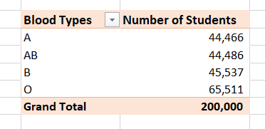
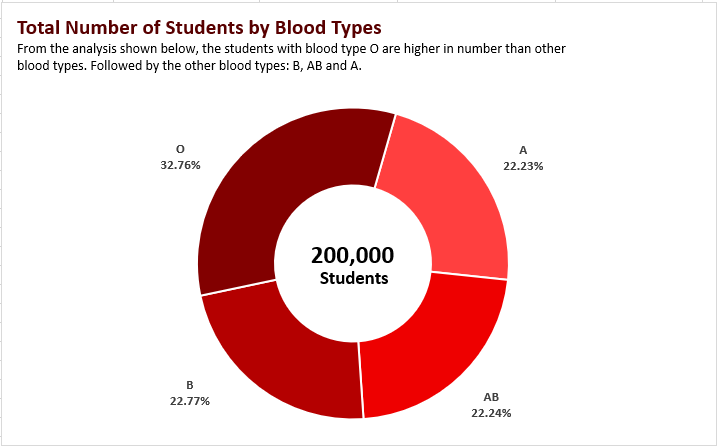
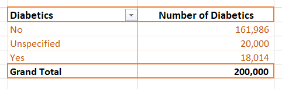
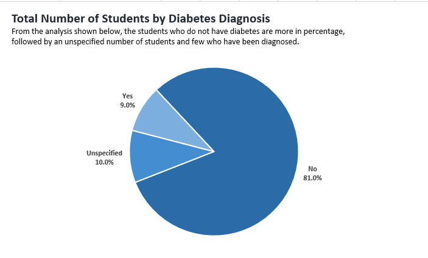
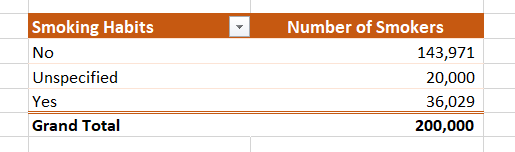
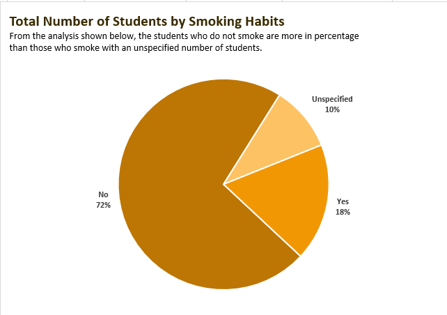

# MEDICAL STUDENTS' HEALTH ANALYSIS

## Introduction
In this Microsoft Excel project, I delved into the different health metrics of Junior and Senior medical students of **ABC Teaching Hospital.** 🧑‍⚕️ Ranging from their height and weight to their smoking habits. Valuable insights were drawn using pivot tables from the data obtained and represented using clear visuals. 

**_Disclaimer_** ⚠️- _All data used for this analysis are hypothetical data generated and do not represent any real hospital or medical institution._ :heal

## Problem Statement

The main objective of this analysis is to investigate the demographic information, health factors and lifestyle preferences of male and female medical students in a particular institution. These information will be used to draw informed decisions to enforce better living among the students.

The task is to create Pivot Tables displaying the following:
- Average values for the following for Males and Females (Age, BMI, Temperature, Heart Rate, Blood Pressure, and Cholesterol levels)
- Average Height and Weight for both Genders.
- Number of students across the different Blood Groups.
- Number of Students who smoke and those who do not.
- Number of Students who have diabetes and those who don't.
- Then make visuals with the insights obtained from the Pivot Tables.

## Data Sourcing and Transformation

The data was provided in the course of an advanced training by the instructor. The data was provided in CSV format, containing information about 200,000 medical students. It was converted to a proper Excel worksheet, arranged properly, cleaned and combed for duplicates. 

## Skills Demonstrated

A lot of essential data analysis skills were demonstrated in this project. Skills like, data cleaning and transformation, pivot table analysis and visualization, and Excel functions ranging from sum to average.

## Pivot Table Analysis and Visualization

                                  |                                          
:------------------------------------------------------------:|:--------------------------------------------------------------------------:

Pivot table and bar chart showing the average values of the medical students' body mass index (BMI), age, heart rate, temperature, blood pressure and cholesterol levels based on gender difference. This analysis shows there's no significant difference in these values between the males and females.

                                    |                                          
:-------------------------------------------------------------:|:--------------------------------------------------------------------------:

Pivot table and bar chart showing the average values of the medical students' height and weight; and there's no significant difference observed in these values between the males and females.

                                      |                                          
:-------------------------------------------------------------:|:--------------------------------------------------------------------------:

This analysis shows the different blood types found amongst the students and from our table and visuals, the blood type 0 is predominant with a percentage of 32.76% followed by B, AB and A respectively.

                                         |                                          
:--------------------------------------------------------------:|:--------------------------------------------------------------------------:

This analysis shows the total number of students with diabetes represented as 9% of the population and students who do not have the disease as 81% and an unspecified number of students as 10%.

                                           |                                          
:---------------------------------------------------------------:|:--------------------------------------------------------------------------:

In this analysis, a good number of medical students were identified as non-smokers and quite a few identified as smokers and the rest were unspecified. 

## Conclusion and Recommendation

- The “Unspecified” categories should be investigated and properly categorized to comprehensively understand their status and enable informed decisions.
- Smoking Rehabilitation Programs should be set up within the medical student community. The program should include counselling, addiction treatment, and support groups.
- Health Education and Awareness programs on Diabetes should also be introduced in the medical community, emphasising healthier food choices, regular check-ups and exercises.
- Generally, periodic medical check-ups and follow-up assessments should be carried out to track changes and monitor health progression, which will improve overall health outcomes within the medical student community.

Our Health should always be our priority. Eat healthy and exercise regularly. As said by Jim Rohn, "Take care of your body. It's the only place you have to live." 💪

# THANK YOU ⚕️

